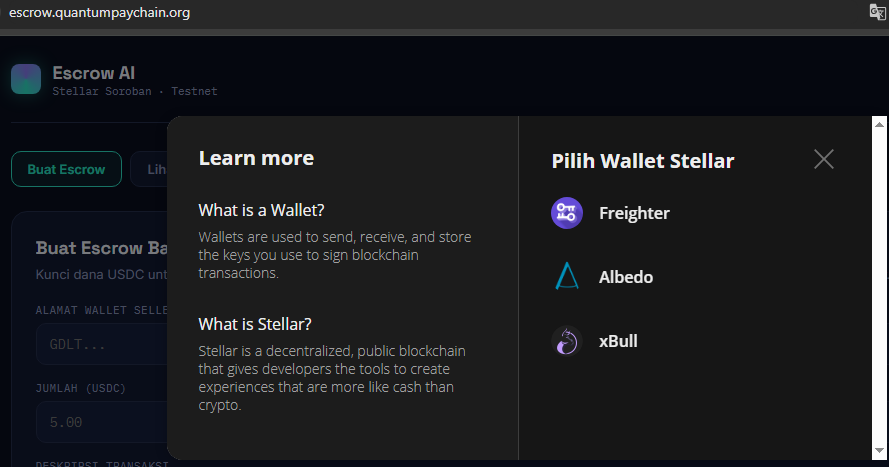
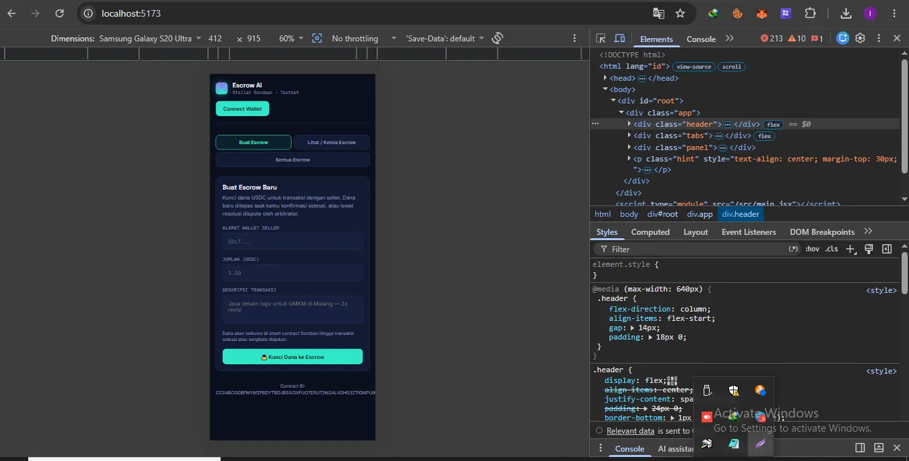
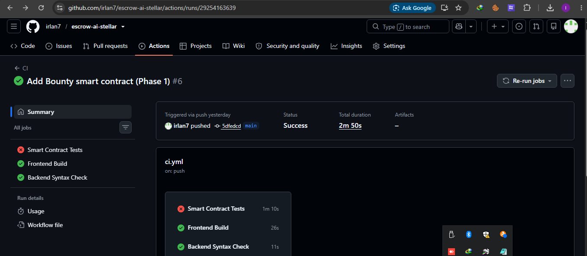
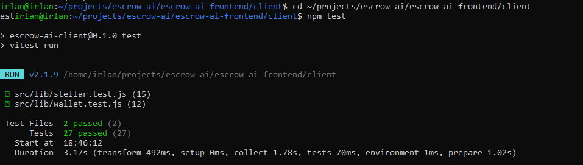

# Escrow AI — Frontend

Frontend + AI recommendation service for **Escrow AI**, a pair of on-chain protocols on Stellar (Soroban): an escrow payment system with AI-assisted dispute resolution, and a bounty system with deterministic (code-based) verification.

📄 **[Smart contract ↔ frontend integration evidence (code excerpts + function mapping)](./INTEGRATION_EVIDENCE.md)**

## Smart Contracts (live on testnet)

### 1. Escrow AI — Payment
Contract ID : CC2ABCGDBFMYMZFBDYTBDJBSIXOXFUO7D5U72M2ALVGHG3ZTIGMPUIM4
USDC (SAC) : CBIELTK6YBZJU5UP2WWQEUCYKLPU6AUNZ2BQ4WWFEIE3USCIHMXQDAMA
Arbitrator : GBYKGB7JKBF54BXVJ2JOVG6OE35GCRKNZK7M7RSMPJNFBT45WLAERR6K
Network : Stellar Testnet
Locks buyer funds, releases on completion or dispute resolution. On dispute, an AI layer (Cerebras) gives the arbitrator a structured recommendation — the arbitrator always makes and executes the final decision.

### 2. Escrow Bounty (Phase 1)
Contract ID : CC4IPCE66MYIAL7DCWHRN7MUIJMIUZMY6JBXAWMNWFATQYXZLS7KCPQ5
Network : Stellar Testnet
Locks sponsor rewards, pays out automatically once a claim is verified against deterministic, code-based checks (Tier 1) — not AI opinion. For subjective (Tier 2) criteria, an AI advisory endpoint gives the arbitrator a recommendation only; it never auto-approves. Includes nonce-based replay protection on claims (tested on-chain: a reused nonce is rejected).

## Submission details

- **Live demo**: https://escrow.quantumpaychain.org (production, VPS + custom domain) or https://escrow-ai-stellar.vercel.app (Vercel mirror)
- **Deployed contract addresses**:
  - Escrow AI Payment: [`CC2ABCGDBFMYMZFBDYTBDJBSIXOXFUO7D5U72M2ALVGHG3ZTIGMPUIM4`](https://stellar.expert/explorer/testnet/contract/CC2ABCGDBFMYMZFBDYTBDJBSIXOXFUO7D5U72M2ALVGHG3ZTIGMPUIM4)
  - Escrow Bounty: [`CC4IPCE66MYIAL7DCWHRN7MUIJMIUZMY6JBXAWMNWFATQYXZLS7KCPQ5`](https://stellar.expert/explorer/testnet/contract/CC4IPCE66MYIAL7DCWHRN7MUIJMIUZMY6JBXAWMNWFATQYXZLS7KCPQ5)
- **Sample transaction** (`create_escrow` call, verifiable on Stellar Expert): [`d881345172492fa5267bf96d78b3473d8ab973d804290ef8a45145686f9b072c`](https://stellar.expert/explorer/testnet/tx/d881345172492fa5267bf96d78b3473d8ab973d804290ef8a45145686f9b072c)
- **Wallet options available** (StellarWalletsKit multi-wallet modal — Freighter, Albedo, xBull, plus WalletConnect for mobile wallets):

  

- **Mobile responsive UI**:

  

- **CI/CD pipeline running** (GitHub Actions):

  

- **Contract test output**:

  

- **Demo video** (live walkthrough — create escrow, dispute, AI recommendation, arbitrator resolve): https://youtu.be/8AmkmNDBAcc

## Folder structure
escrow-ai-frontend/
├── client/ React + Vite — buyer/seller/arbitrator UI, multi-wallet connect
└── server/ Express — proxies Cerebras AI calls (keeps the API key off the browser)

contracts/
├── contracts/escrow/ Escrow AI Payment contract (Rust/Soroban)
└── bounty/ Escrow Bounty contract (Rust/Soroban)
## Prerequisites

- Node.js 18+ and npm
- Any Stellar wallet supported by [StellarWalletsKit](https://stellarwalletskit.dev) — Freighter, Albedo, xBull (desktop extensions), or Freighter Mobile via WalletConnect, network set to **Testnet**
- A free Cerebras API key — get one at https://cloud.ai.cerebras.ai/

## Setup — Backend (AI recommendation service)

```bash
cd server
npm install
cp .env.example .env
```

Edit `.env` and set `CEREBRAS_API_KEY` to your real API key (free at cloud.ai.cerebras.ai). Then run:

```bash
npm run dev
```

The server runs on `http://localhost:3001`. Verify by opening `http://localhost:3001/health` — it should return `{"status":"ok",...}`.

## Setup — Frontend

In a separate terminal:

```bash
cd client
npm install
cp .env.example .env
npm run dev
```

Open `http://localhost:5173` in your browser (make sure a supported wallet extension is active, or use WalletConnect from a mobile wallet).

## Testing flow — Escrow AI Payment

1. **Connect Wallet** — click the button top-right, pick a wallet in the modal, approve in the wallet popup
2. **Create Escrow** — fill in the seller address, USDC amount, description → click "Lock Funds into Escrow"
   - The connected wallet needs testnet USDC balance + a trustline (see "Set up a test wallet" below)
3. **View / Manage Escrow** — enter an escrow ID to see its details
   - If status is `Pending` and the connected wallet is that escrow's buyer → Release / Raise Dispute buttons appear
   - If status is `Disputed` → a "Get AI Recommendation" button appears; if the connected wallet is the arbitrator address → resolve buttons appear
4. **All Escrows** — browse every escrow ever created, click a row to open its details

## Testing flow — Escrow Bounty

Tested via Stellar CLI (`stellar contract invoke`) end-to-end: `create_bounty` (sponsor locks reward) → `submit_claim` (hunter submits proof + nonce) → `submit_verification_result` (verifier submits a deterministic pass/fail) → automatic payout to the hunter on Tier 1 pass, or routed to `resolve_dispute` (arbitrator) for Tier 2. Nonce replay protection was explicitly tested: resubmitting the same nonce for the same bounty is rejected on-chain.

## Set up a test wallet (buyer needs testnet USDC)

The buyer wallet needs a trustline + USDC balance before it can call `create_escrow`:

1. Open [Stellar Lab Friendbot](https://lab.stellar.org/account/fund) → select the USDC asset → click "Add trustline" for your buyer address
2. Open the [Circle USDC Faucet](https://faucet.circle.com/) → select the Stellar network → paste the buyer address → request tokens (20 USDC per request)

## Analytics & Monitoring

The backend tracks basic product usage events (page views, wallet connects, escrow actions) to a simple JSON-file store — no third-party analytics service, data stays on our own infrastructure.
GET /api/analytics/summary total events, unique wallets, breakdown by event type
POST /api/analytics/track internal use, called by the frontend
Tracked events: `page_view`, `wallet_connect_attempted`, `wallet_connect`, `wallet_connect_failed`, `create_escrow`, `raise_dispute`, `ai_recommendation_requested`, `resolve_dispute`, `release_escrow`.

Check current numbers anytime:
```bash
curl https://escrow.quantumpaychain.org/api/analytics/summary
```

## User Feedback

A feedback widget (bottom-right "Feedback" button) lets any user leave a 1-5 star rating plus an optional comment, stored via the backend.
GET /api/feedback/summary total responses, average rating, all responses
POST /api/feedback internal use, called by the feedback widget
```bash
curl https://escrow.quantumpaychain.org/api/feedback/summary
```

Full survey (wallet address, email, name, rating, comments) is also collected via a linked Google Form: **[link to be added]** — exported to Excel for record-keeping: **[link to be added]**.

## Improvement Plan — Iterating on Real User Feedback

Feedback collected so far (both via the in-app widget and direct testing) has been positive on core usability ("Simple, easy to use, low charge"; "connect wallet mudah, escrow cepat"). Rather than waiting only for written complaints, we also mined our own **analytics data** for friction signals — and found a real one: a large gap between `wallet_connect_attempted` and successful `wallet_connect` events, concentrated on mobile devices. This directly drove several product iterations already shipped:

| Issue found | Evidence | Fix (commit) |
|---|---|---|
| App crashed (blank screen) on some mobile devices when opening | Direct user reports (screenshots) + analytics showing failed connect attempts | `Fix root cause of mobile crash: selectedWalletId must match actually-registered modules per device` |
| Users on mobile-only devices couldn't connect at all | User feedback: "I only have a phone, no laptop" | `Add WalletConnect support for mobile wallets (Freighter Mobile, etc)` |
| Freighter (desktop extension) showed as "Not available" on mobile, confusing users into clicking the wrong option | Screenshot from a real tester | `Fix mobile UX: hide desktop-only extension options on mobile, only show WalletConnect` |
| Silent crashes gave no diagnostic information, making it impossible to help affected users | Repeated "blank screen" reports with no actionable detail | `Add global error catcher for mobile debugging - shows readable error instead of blank black screen` |

**Planned next iterations** (based on ongoing feedback + roadmap):
- Reduce onboarding friction further for first-time WalletConnect users (currently requires searching for "Freighter" in the wallet list — investigating `featuredWalletIds` support once upstream library stability is confirmed)
- Add Stellar Anchor (SEP-24) integration so payout recipients can cash out directly to local currency, addressing the gap between "funds received on-chain" and "money I can actually spend" — a concern raised informally by early testers from our target user base (migrant workers/freelancers)
- Expand the Escrow Bounty module (Tier 2 challenge window, multi-RPC quorum verification) based on the security review conducted with the team

## Deploying to production — VPS (existing system nginx)

This setup **does not run its own reverse proxy** — the Escrow AI containers only bind to `127.0.0.1` (internal ports). The system nginx already running on the VPS (serving other projects) gets one new config file for the Escrow AI domain. No other domain/project config is touched.

### VPS prerequisites
- Docker & Docker Compose installed
- System nginx + certbot already running (outside Docker)
- The domain `escrow.quantumpaychain.org` (or your own) already has an A record pointing to this VPS's IP

### 1. Run the containers (internal ports only)

```bash
git clone https://github.com/irlan7/escrow-ai-stellar.git
cd escrow-ai-stellar
cp .env.example .env
nano .env

docker compose up -d --build
```

Verify the containers are running on internal ports (not exposed publicly):

```bash
docker compose ps
curl http://127.0.0.1:8095
curl http://127.0.0.1:8096/health
```

### 2. Register the domain with the system nginx

```bash
sudo cp deploy/escrow.quantumpaychain.org /etc/nginx/sites-available/escrow.quantumpaychain.org
sudo ln -s /etc/nginx/sites-available/escrow.quantumpaychain.org /etc/nginx/sites-enabled/
sudo nginx -t
sudo systemctl reload nginx
```

### 3. Enable HTTPS via certbot (same as every other domain on this VPS)

```bash
sudo certbot --nginx -d escrow.quantumpaychain.org
```

Open `https://escrow.quantumpaychain.org` — frontend at `/`, AI backend at `/api/*`.

### Updating after a code change

```bash
git pull
docker compose up -d --build
```

### Vercel mirror (optional, to satisfy the organizers' request)

1. Import this repo into vercel.com, root directory `client`
2. Set env var `VITE_AI_API_URL` = `https://escrow.quantumpaychain.org`
3. Deploy

## Technical notes

- **Multi-wallet**: wallet connection goes through StellarWalletsKit, supporting Freighter, Albedo, and xBull (desktop extensions) plus WalletConnect (mobile wallets, e.g. Freighter Mobile) via a single selection modal.
- **Granular error handling**: the `WalletError` class (in `client/src/lib/wallet.js`) classifies errors into categories with specific messages — wallet not found, transaction rejected by user, and insufficient balance.
- **Transaction status tracking**: every write transaction goes through explicit stages shown live in the UI — building, simulating, awaiting signature, submitting, pending, success/failed.
- **Event listening & state sync**: `client/src/lib/stellar.js` polls `getEvents()` from the Soroban RPC every 6 seconds to watch for real on-chain events. Relevant screens auto-refresh their data when a new event is detected.
- **Bounty nonce binding**: `submit_claim()` on the Bounty contract requires a unique nonce per bounty; reusing a nonce for the same bounty is rejected on-chain, preventing replay of a stale claim transaction.
- **Tier 2 AI Advisory**: for subjective bounty criteria, `/api/bounty/tier2-advisory` gives the arbitrator a structured recommendation with `requires_human_review` forced true in code (not just trusted from the LLM output) — this endpoint is resistant to prompt injection via user-controlled `hunter_notes` (tested).
- All contract write calls require a wallet signature — the user's wallet signs, never the backend.
- Read calls only simulate a transaction (no signature/fee needed), using the arbitrator address as the simulation source since it is guaranteed to exist on the ledger.
- The AI recommendation runs through the backend using Cerebras (free tier) so the API key is never exposed to the browser. If the live API call fails, the backend automatically returns a fallback response so the demo never fully breaks.
